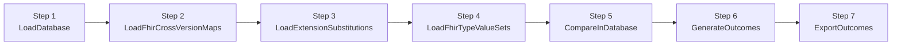

# Cross-Version FHIR Artifacts Generation Process

## Overview

The cross-version FHIR artifacts generation pipeline produces the
deployable Implementation Guide content that lets consumers of one FHIR
release work with artifacts authored against a different release. A
single run can emit, per source/target FHIR version pair:

- **Cross-version Extension StructureDefinitions** for source-version
  elements that have no direct equivalent in the target version.
- **Cross-version ValueSets and CodeSystems** for source-version
  vocabulary that doesn't expand cleanly into the target.
- **ConceptMaps** for renamed resources/types/elements and for renamed
  value-set codes.
- **Validation IG packages** for each supported FHIR release.
- **IG-publisher-ready scaffolding** (`ig.ini`, `ig.json`, `menu.xml`,
  page content) so the produced IGs can be built and published with the
  standard HL7 IG publisher tooling.

The pipeline runs offline from a SQLite "comparison database" that the
loader builds up from the configured FHIR core packages plus
hand-authored cross-version maps, extension substitutions, and
FHIR-type ValueSets. Subsequent steps compare artifacts pair-by-pair,
classify the comparison results into outcomes, and materialize those
outcomes as on-disk IGs under `OutputDirectory`.

This document is organized around the seven public entry points on
[`XVerProcessor`][src-xverprocessor] (in
`Fhir.CodeGen.Comparison.XVer`). Each step has a dedicated deep-dive
spec under `docs/specs/`; the summaries below link out to them.

### Audience

This is a *contributor* document. It is for people who maintain
`Fhir.CodeGen.Comparison`, who review cross-version package releases,
or who maintain the cross-version map content under
`CrossVersionMapSourcePath`. End-user / consumer documentation for the
published packages is out of scope.

### Entry point

```text
fhir-codegen ... xver <subcommand>
  → Program.DoXVer                                           (Program.cs:~345)
    → new XVerProcessor(config)
    → XVerProcessor.ProcessCommand(subcommand)               (XVerProcessor.cs:256)
```

`ProcessCommand` dispatches each subcommand to a different subset of
the seven steps. The full pipeline runs end-to-end when no subcommand
(or an unrecognized one) is passed.

[src-xverprocessor]: https://github.com/FHIR/fhir-codegen/blob/main/src/Fhir.CodeGen.Comparison/XVer/XVerProcessor.cs

## Pipeline at a Glance



Each step writes to a different family of SQLite tables in the
comparison database and the next step reads from those tables, so the
seven steps are run-once-and-cache: re-running the export step alone
is fast as long as the database is current, while a full pipeline run
takes minutes-to-hours depending on the number of packages loaded.

Steps 5, 6, and 7 each have an optional `artifactFilter` argument
(`FhirArtifactClassEnum`) that restricts the work to vocabulary
(`CodeSystem`/`ValueSet`) or structures (`PrimitiveType` /
`ComplexType` / `Resource` / `Profile` / `Extension`). The filter
shape is consistent across all three steps, which is what makes
vocabulary-only and structures-only inner-loop runs viable.

## Subcommand → Step Matrix

The rows are `ProcessCommand` subcommands; the columns are the seven
steps. The cell vocabulary is:

| Cell value | Meaning |
|---|---|
| `direct` | Subcommand explicitly calls this step. |
| `if ReloadDatabase` | Called only when `_config.ReloadDatabase == true`. |
| `—` | Not run by this subcommand. |
| `n/a (scratch)` | The `wip` subcommand is a developer scratch path. |
| `n/a (outside pipeline)` | The `update-vs-maps` subcommand is outside the seven-step pipeline. |

| Subcommand | LoadDatabase | LoadFhirCrossVersionMaps | LoadExtensionSubstitutions | LoadFhirTypeValueSets | CompareInDatabase | GenerateOutcomes | ExportOutcomes |
|---|---|---|---|---|---|---|---|
| `wip` [¹](#wip-note) | `n/a (scratch)` | `n/a (scratch)` | `n/a (scratch)` | `n/a (scratch)` | `n/a (scratch)` | `n/a (scratch)` | `n/a (scratch)` |
| `update-vs-maps` [²](#updatevsmaps-note) | `n/a (outside pipeline)` | `n/a (outside pipeline)` | `n/a (outside pipeline)` | `n/a (outside pipeline)` | `n/a (outside pipeline)` | `n/a (outside pipeline)` | `n/a (outside pipeline)` |
| `load` | `direct` | `direct` | `direct` | `direct` | `—` | `—` | `—` |
| `load-base` | `direct` | `—` | `direct` | `—` | `—` | `—` | `—` |
| `load-maps` | `—` | `direct` | `—` | `direct` | `—` | `—` | `—` |
| `load-substitutions` | `—` | `—` | `direct` | `—` | `—` | `—` | `—` |
| `compare` | `if ReloadDatabase` | `if ReloadDatabase` | `if ReloadDatabase` | `if ReloadDatabase` | `direct` | `—` | `—` |
| `compare-vs` | `if ReloadDatabase` | `if ReloadDatabase` | `if ReloadDatabase` | `if ReloadDatabase` | `direct` | `—` | `—` |
| `compare-sd` | `if ReloadDatabase` | `if ReloadDatabase` | `if ReloadDatabase` | `if ReloadDatabase` | `direct` | `—` | `—` |
| `outcomes` | `if ReloadDatabase` | `if ReloadDatabase` | `if ReloadDatabase` | `if ReloadDatabase` | `—` | `direct` | `—` |
| `outcomes-vs` | `if ReloadDatabase` | `if ReloadDatabase` | `if ReloadDatabase` | `if ReloadDatabase` | `—` | `direct` | `—` |
| `outcomes-sd` | `if ReloadDatabase` | `if ReloadDatabase` | `if ReloadDatabase` | `if ReloadDatabase` | `—` | `direct` | `—` |
| `export` | `if ReloadDatabase` | `if ReloadDatabase` | `if ReloadDatabase` | `if ReloadDatabase` | `—` | `—` | `direct` |
| *default (full pipeline)* | `direct` | `direct` | `direct` | `direct` | `direct` | `direct` | `direct` |

<a name="wip-note"></a>**[¹] `wip` is a developer scratch path.** Its
body is mostly commented-out invocations; the currently-live call is a
single `ExportOutcomes(includeIgScripts: true, specificPairs:
specificPairs)` with `specificPairs = [(R5, R4)]`. Treat any change to
`wip` as developer-facing only; it is not part of the documented
production pipeline (`XVerProcessor.cs:260-308`).

<a name="updatevsmaps-note"></a>**[²] `update-vs-maps` is outside the
seven-step pipeline.** It runs `UpdateValueSetMaps()`, which loads
core definitions and edits source map files in place under
`<CrossVersionMapSourcePath>/input/codes-v2/`; it does not touch the
comparison database (`XVerProcessor.cs:310-312, 433-497`).

### Implicit `LoadDatabase` fallback

Every step except `LoadDatabase` itself calls `LoadDatabase(false)`
lazily when `_db is null` (see `XVerProcessor.cs:565, 621, 675, 753,
770, 794`). This means a subcommand whose matrix row has `—` for the
load columns will still open the existing on-disk SQLite database if
one is found. A full **rebuild** requires either
`_config.ReloadDatabase == true` or invoking `load` / `load-base`
explicitly first.

## Step 1: `XVerProcessor.LoadDatabase`

`LoadDatabase` either reuses an existing SQLite comparison database or
creates a fresh one and loads all configured FHIR core packages
(`ComparePackages`) into it. Reading an existing DB is free; building a
new one downloads and parses every package and seeds the schema
(`DbFhirPackage`, `DbStructureDefinition`, `DbElement`,
`DbElementType`, `DbValueSet`, `DbValueSetConcept`, …).

Notable decisions baked into this step include the
`_exclusionSet` of ValueSet/CodeSystem URLs that are silently dropped
on load (e.g. `ucum-units`, `all-languages`, `mimetypes`, `timezones`,
plus their DSTU2 BCP47/BCP13 variants), the `_escapeValveCodes`
(`OTHER`/`OTH`/`UNKNOWN`/`UNK` and case variants) that downstream
generators recognize specially, and the R5-only `hl7.terminology@5.1.0`
add-on injected by `loadDefinitionCollections`.

See [`xver-load-database.md`](../specs/xver-load-database.md) for the
full deep-dive, including the apparently-inverted `PackageIsFhirCore`
guard in `loadDefinitionCollections` (flagged for reviewer
confirmation).

## Step 2: `XVerProcessor.LoadFhirCrossVersionMaps`

`LoadFhirCrossVersionMaps` ingests externally-authored cross-version
mapping content (ConceptMaps and supporting metadata under
`<CrossVersionMapSourcePath>/...`) into the comparison database via
`MappingLoader.TryLoadCrossVersionSourceMaps`. The
`UseInternalTypeMaps` config flag selects whether the built-in
primitive-type map collection is preferred over (or as a fallback for)
the on-disk maps.

The loaded maps become substitution authorities during the comparison
phase: they let `FhirDbComparer.Compare` (and the per-family
comparers it dispatches to) use SME-authored mappings instead of, or
in addition to, the algorithmic name-based matching.

Notable: the entry method silently discards the loader's `bool`
return value via `_ = mappingLoader.TryLoadCrossVersionSourceMaps(...)`
— load failures are recorded only in the logger, not propagated to
the caller. This is the opposite of how `LoadExtensionSubstitutions`
and `LoadFhirTypeValueSets` treat their loader returns (both throw).

See
[`xver-load-fhir-cross-version-maps.md`](../specs/xver-load-fhir-cross-version-maps.md).

## Step 3: `XVerProcessor.LoadExtensionSubstitutions`

`LoadExtensionSubstitutions` is the step where pipeline maintainers
inject human judgment into the generation process. It ingests
hand-authored extension-substitution definitions — assertions that say
"when source element X needs to be carried in target version Y, use
extension URL Z" — into the database via
`ComparisonDatabase.TryLoadExtensionSubstitutions`. The resulting
`DbExtensionSubstitution` rows are consulted by
`ElementOutcomeGenerator` during outcome generation and **win over**
algorithmically-derived mappings for the matching elements.

Substitutions are matched against `SourceElementId`, the cleaned form
of `SourceElementId` (`[x]` suffix stripped), and the same two forms of
any `SourceContextElementIds` listed on the substitution; the last
matching row for each ID wins (the dictionary is overwrite-on-collide).

Unlike `LoadFhirCrossVersionMaps`, this entry method **throws** on
loader failure, propagating an explicit error with the configured
source path.

See
[`xver-load-extension-substitutions.md`](../specs/xver-load-extension-substitutions.md).

## Step 4: `XVerProcessor.LoadFhirTypeValueSets`

`LoadFhirTypeValueSets` loads a curated list of "FHIR-type ValueSets"
(ValueSets whose codes are FHIR type names like `Patient`,
`Observation`, etc.) into the `DbFhirTypeValueSet` table via
`ComparisonDatabase.TryLoadFhirTypeValueSets`. Downstream consumers —
principally `ValueSetComparer.CompareValueSets` — read the list once
into a `HashSet<string>` and consult it when deciding how to compare
ValueSets whose codes are FHIR type names (rather than ordinary
terminology codes).

Like `LoadExtensionSubstitutions`, this entry method **throws** on
loader failure.

See
[`xver-load-fhir-type-valuesets.md`](../specs/xver-load-fhir-type-valuesets.md).

## Step 5: `XVerProcessor.CompareInDatabase`

`CompareInDatabase` runs the actual comparison work over the loaded
database. It constructs a `FhirDbComparer` and dispatches to
`FhirDbComparer.Compare(processValueSets, processStructures,
maxStepSize, specificPairs)` with the boolean pair derived from the
optional `artifactFilter`. `FhirDbComparer.Compare` itself is small:
it drops and recreates the requested comparison tables, then delegates
to `ValueSetComparer.CompareValueSets` and/or
`StructureComparer.CompareStructures`, which do the per-package-pair
work.

The pair-iteration order is "closer first" via a stepped algorithm —
distance 1 pairs (e.g. R4 ↔ R4B) are processed before distance 2 pairs
(e.g. R4 ↔ R5), etc., capped by `maxStepSize`. Each step size is
processed in both ascending (`Up`) and descending (`Down`)
[`ComparisonDirection`s][src-direction], filtered by the optional
`specificPairs` set. **The comparison phase is destructive**: every
invocation drops the prior comparison tables before writing fresh
results.

See [`xver-compare-in-database.md`](../specs/xver-compare-in-database.md)
for the orchestration, and
[`fhirdb-comparer-compare.md`](../specs/fhirdb-comparer-compare.md) for
the internals of `FhirDbComparer.Compare`.

[src-direction]: https://github.com/FHIR/fhir-codegen/blob/main/src/Fhir.CodeGen.Comparison/XVer/ComparisonAnnotation.cs

## Step 6: `XVerProcessor.GenerateOutcomes`

`GenerateOutcomes` is the decision-densest step. It reads the
comparison rows produced by step 5 and emits **outcome rows**
(`DbValueSetOutcome`, `DbValueSetConceptOutcome`, `DbStructureOutcome`,
`DbElementOutcome`, `DbElementOutcomeTarget`) that classify each
source artifact for downstream export. Like `CompareInDatabase`, this
phase is destructive: every invocation drops the prior outcome tables.

The dispatch shape mirrors `CompareInDatabase`: an artifact filter of
`CodeSystem`/`ValueSet` runs vocabulary-only, the structure classes
run structures-only, and a null filter runs both. Inside,
`OutcomeGenerator` instantiates `ValueSetOutcomeGenerator` and/or
`StructureOutcomeGenerator`; the structure path also builds an
`ElementOutcomeGenerator` per package pair.

`ElementOutcomeGenerator` is where the headline decisions are made:
for each source element, is it kept as-is (same name), kept under a
different name (renamed), represented as a cross-version
StructureDefinition extension, deferred to an ancestor's extension, or
carried in a `Basic` resource? The
`_extensionSubstitutionsByElementId` dictionary built from
`DbExtensionSubstitution` rows participates here and wins over the
algorithmic mapping when a match is found.

A notable implementation detail surfaced in the deep-dive: the
`OutcomeValueSetActionCodes` / `OutcomeStructureActionCodes` /
`OutcomeElementActionCodes` enums are declared but **not directly
assigned to row columns**. The outcome category is instead encoded
through row fields like `RequiresXVerDefinition`, `IsRenamed`,
`ExtensionSubstitutionKey`, and `BasicElementId`. Consumers (the
exporters) read those fields, not the enum values.

See [`xver-generate-outcomes.md`](../specs/xver-generate-outcomes.md).

## Step 7: `XVerProcessor.ExportOutcomes`

`ExportOutcomes` is the last step and the only one that writes files.
It constructs an `XVerExporter` against the open SQLite connection and
dispatches to `XVerExporter.Export(includeIgScripts, processVocabulary,
processStructures, maxStepSize, specificPairs)` with the
`processVocabulary` / `processStructures` pair derived from the
artifact filter. `includeIgScripts` defaults to
`_config.XverIncludeScripts` when the caller doesn't pass an explicit
value.

`XVerExporter.Export` itself is a thin coordinator. It builds the
per-pair Implementation Guide skeletons via
`IgExporter.CreateInitialXVerIgs`, then dispatches to the four content
exporters (`VocabularyFhirExporter`, `VocabularyPageExporter`,
`StructureFhirExporter`, `StructurePageExporter`), and finishes with
`IgExporter.FinalizeXVerIgs` to write `ig.ini` / `ig.json` /
`menu.xml` for each tracked IG.

Output is per-pair: there is no comprehensive "all-in-one" package.
Each `(source, target)` pair produces its own IG directory under
`<OutputDirectory>/fhir/...`, and each FHIR release allowed by the
`ExportR2`..`ExportR6` flags also produces a validation IG. The
canonical-URL root for all emitted content is
`_canonicalRootCrossVersion = "http://hl7.org/fhir/uv/xver/"`. The
version stamp on emitted artifacts (`_crossDefinitionVersion`)
resolves with three layers of precedence: explicit
`config.XverArtifactVersion`, then the `PackageVersion` from
`<CrossVersionMapSourcePath>/input/ig-support/xver-package-config.json`,
then `"0.1.0"` as a final default.

See [`xver-export-outcomes.md`](../specs/xver-export-outcomes.md) for
the orchestration view (from `XVerProcessor.ExportOutcomes`'
perspective), and
[`xver-exporter-export.md`](../specs/xver-exporter-export.md)
for the deep-dive of `XVerExporter.Export` and its five component
exporters.

## Glossary

- **Comparison database** — the SQLite database built by `LoadDatabase`
  and referenced by every other step. Located at
  `<CrossVersionDbPath>` if set, otherwise
  `<CrossVersionMapSourcePath>/db/...`. Schema and seeding live in
  `Fhir.CodeGen.Comparison.Models.ComparisonDatabase`.
- **Cross-version map** — an SME-authored ConceptMap (or supporting
  metadata file) under `CrossVersionMapSourcePath` that asserts how
  ValueSet concepts, resource types, element types, or other artifacts
  in one FHIR release relate to artifacts in another release. Loaded
  by `LoadFhirCrossVersionMaps`.
- **Extension substitution** — an SME-authored row that pins a specific
  source element to a specific target extension URL, overriding the
  algorithmic mapping decision. Stored as `DbExtensionSubstitution`
  rows; loaded by `LoadExtensionSubstitutions`; consumed by
  `ElementOutcomeGenerator` via `_extensionSubstitutionsByElementId`.
- **FHIR-type ValueSet** — a ValueSet whose codes are FHIR type names
  (e.g. the `all-types` ValueSet). The curated list of these is
  loaded by `LoadFhirTypeValueSets` into `DbFhirTypeValueSet`;
  `ValueSetComparer.CompareValueSets` reads the URL set once and uses
  it to special-case comparison of those ValueSets.
- **Escape-valve code** — one of `OTHER` / `Other` / `other` / `OTH`
  (v3 Null Flavor) / `UNKNOWN` / `Unknown` / `unknown` / `UNK` (v3
  Null Flavor). Defined in `XVerProcessor._escapeValveCodes`
  (`XVerProcessor.cs:130-143`). Downstream generators treat these
  codes as universally-mappable across versions, avoiding spurious
  unmapped-concept outcomes.
- **`_exclusionSet`** — the constant set of ValueSet/CodeSystem URLs
  (`ucum-units`, `all-languages`, `mimetypes`, `timezones`, plus their
  DSTU2 BCP47/BCP13 variants) that the pipeline silently drops. The
  set is applied both at DB-load time and again at export time as
  defense-in-depth (`XVerProcessor.cs:113-128`).
- **Comparison direction (`Up` / `Down`)** — the
  [`ComparisonDirection`][src-direction] enum at
  `Fhir.CodeGen.Comparison.XVer.ComparisonAnnotation`. `Up` is the
  ascending traversal (lower-index → higher-index FHIR sequence);
  `Down` is descending. The active comparers iterate both directions
  per step-size.
- **Comparison pair / package pair** — a `(source, target)`
  `DbFhirPackage` pair, wrapped at runtime in
  `FhirPackageComparisonPair`. The exporters key per-pair caches by
  the `SequencePair = (SourceFhirSequence, TargetFhirSequence)` tuple.
- **`maxStepSize`** — optional integer that caps how far apart (in
  package-list index) two FHIR versions may be while still being
  paired. Defaults to `_packages.Count - 1` (i.e. every pair). Small
  values are useful for inner-loop development against neighbor-only
  pairs.
- **`specificPairs`** — optional set of `(source, target)`
  `FhirSequenceCodes` tuples. When non-null, only the listed pairs
  are produced; when null, the full `_allowedExportVersions`
  cross-product is used. Filtering is applied per direction.
- **Basic-path fallback** — the export strategy of representing a
  source element as a member of a `Basic` resource on the target side,
  used when no extension representation is feasible. Encoded via
  `BasicElementId` on `DbElementOutcome` rows and the
  `OutcomeElementActionCodes.UseBasicElement` / `UseBasicResource`
  enum values.
- **Inherited-from-ancestor extension** — the export strategy of
  reusing a parent element's already-emitted cross-version extension
  rather than emitting a new one for the child element. Encoded via
  `OutcomeElementActionCodes.UseExtensionFromAncestor`.

---
*Verified against commit `d02100974b2dc1b05ecf1af69c29095e6973f4c8` on `2026-06-04`.*
