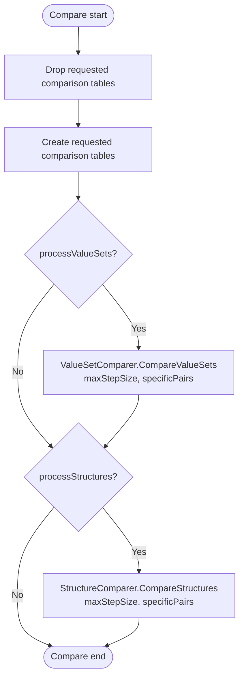

# FhirDbComparer.Compare Specification

## Executive Summary

The `FhirDbComparer.Compare` method is now a compact orchestration entry point for rebuilding comparison output tables and delegating comparison work. It does not walk source packages, build package-pair records, or perform artifact-level comparison loops itself. Instead, it drops and recreates the requested comparison tables, then invokes `ValueSetComparer.CompareValueSets` and/or `StructureComparer.CompareStructures` with the same pair-window options supplied by the caller (`src\Fhir.CodeGen.Comparison\CompareTool\FhirDbComparer.cs:111-142`).

## Architecture Overview

The comparison pipeline is split between the public `FhirDbComparer` facade and focused comparer classes:

```
FhirDbComparer (public facade)
├── FhirDbComparer.cs           - Compare entry point, DB connection/logger ownership, table reset, delegation
├── ValueSetComparer.cs         - Active value set package-pair orchestration and value set/concept cache flushing
├── StructureComparer.cs        - Active structure package-pair orchestration and structure/element/type cache flushing
├── ElementComparer.cs          - Element comparison support used by StructureComparer
├── ElementTypeComparer.cs      - Element type comparison support used by ElementComparer
├── FhirDbComparerValueSets.cs  - Partial-class value set routines documented separately; not duplicated here
└── FhirDbComparerStructures.cs - Partial-class structure routines documented separately; not duplicated here
```

`FhirDbComparer` owns the `ComparisonDatabase` connection and logger factory (`FhirDbComparer.cs:88-108`). Runtime comparison caches are owned by the delegated comparer classes, not by the `Compare` method body.

## Detailed Algorithm

### Method Signature

```csharp
public void Compare(
    bool processValueSets = true,
    bool processStructures = true,
    int? maxStepSize = null,
    HashSet<(FhirReleases.FhirSequenceCodes s, FhirReleases.FhirSequenceCodes t)>? specificPairs = null)
```

### Parameters

- **processValueSets**: When `true`, reset the value set comparison tables and run `ValueSetComparer.CompareValueSets`; when `false`, leave value set comparison tables untouched by the reset call and skip value set processing (`FhirDbComparer.cs:118-130`).
- **processStructures**: When `true`, reset the structure, element, and element type comparison tables and run `StructureComparer.CompareStructures`; when `false`, leave those tables untouched by the reset call and skip structure processing (`FhirDbComparer.cs:118-140`).
- **maxStepSize**: Optional maximum distance between ordered FHIR package versions. If omitted, each delegated comparer uses `_packages.Count - 1`, allowing all distances available in the loaded package list (`ValueSetComparer.cs:107-114`, `StructureComparer.cs:89-97`).
- **specificPairs**: Optional directional set of `(source sequence, target sequence)` pairs. Delegated comparers only process a direction when the set is `null` or contains that exact source/target sequence tuple (`ValueSetComparer.cs:120-142`, `StructureComparer.cs:103-113`).

### Algorithm Steps

1. **Drop requested comparison tables**
   - `Compare` first calls `DbComparisonClasses.DropTables(_db, forValueSets: processValueSets, forStructures: processStructures)` (`FhirDbComparer.cs:117-119`).
   - The drop helper removes `DbValueSetComparison` and `DbValueSetConceptComparison` when value sets are requested, and removes `DbStructureComparison`, `DbElementComparison`, and `DbElementTypeComparison` when structures are requested (`DbComparisonClasses.cs:32-50`).

2. **Create requested comparison tables**
   - `Compare` then calls `DbComparisonClasses.CreateTables(_db, forValueSets: processValueSets, forStructures: processStructures)` (`FhirDbComparer.cs:118-119`).
   - The create helper mirrors the same table groups used by the drop helper (`DbComparisonClasses.cs:52-70`).

3. **Run value set comparisons when requested**
   - If `processValueSets` is `true`, `Compare` constructs `ValueSetComparer` with the shared database connection and logger factory, then calls `CompareValueSets(maxStepSize, specificPairs)` (`FhirDbComparer.cs:121-130`).
   - `CompareValueSets` loads FHIR type value set URLs, loads packages ordered by package version, defaults `maxStepSize`, then processes progressively wider package distances in both ascending and descending directions when allowed by `specificPairs`. For each processed direction it runs the value set comparison pass, applies cached value set/concept changes, and performs concept post-processing (`ValueSetComparer.cs:100-145`). The per-package pass selects source value sets, skips excluded URLs, chooses direct neighbor or transitive comparison paths based on step size, and records comparisons (`ValueSetComparer.cs:318-369`). Lower-level value set comparison details are covered in [fhirdb-comparer-do-valueset.md](./fhirdb-comparer-do-valueset.md).

4. **Run structure comparisons when requested**
   - If `processStructures` is `true`, `Compare` constructs `StructureComparer` with the shared database connection and logger factory, then calls `CompareStructures(maxStepSize, specificPairs)` (`FhirDbComparer.cs:132-140`).
   - `CompareStructures` loads packages ordered by package version, builds a directional package-pair list by step size and `specificPairs`, initializes `ElementComparer`, then processes each package pair in built order and applies cached structure/element/type changes after each pair (`StructureComparer.cs:85-131`). The per-pair pass processes artifact classes in dependency order (`PrimitiveType`, `ComplexType`, `Resource`, `Profile`), selects source structures by class, skips excluded URLs, and chooses direct neighbor or transitive paths based on step size and primitive handling (`StructureComparer.cs:180-246`). Lower-level structure comparison details are covered in [fhirdb-comparer-do-structure.md](./fhirdb-comparer-do-structure.md).

## Mermaid Workflow Diagram



## Dependencies & Interactions

### Called Methods

- **`DbComparisonClasses.DropTables`** (`FhirDbComparer.cs:118`, `DbComparisonClasses.cs:32-50`)
  - Clears only the requested value set and/or structure comparison table groups.
  - Uses the Boolean flags passed directly from `Compare`.

- **`DbComparisonClasses.CreateTables`** (`FhirDbComparer.cs:119`, `DbComparisonClasses.cs:52-70`)
  - Recreates only the requested value set and/or structure comparison table groups.
  - Runs immediately after `DropTables` and before any delegated comparer is constructed.

- **`ValueSetComparer.CompareValueSets`** (`FhirDbComparer.cs:124-129`, `ValueSetComparer.cs:100-145`)
  - Orchestrates package-distance traversal for value sets.
  - Applies `maxStepSize` and `specificPairs` directionally.
  - Flushes value set and concept comparison caches after each processed source/target direction (`ValueSetComparer.cs:194-222`).

- **`StructureComparer.CompareStructures`** (`FhirDbComparer.cs:135-140`, `StructureComparer.cs:85-131`)
  - Builds directional package pairs for structure processing.
  - Applies `maxStepSize` and `specificPairs` before constructing the work list.
  - Flushes structure, element, and element type comparison caches after each processed package pair (`StructureComparer.cs:133-178`).

### Database Operations

- Table reset operations are performed through `DbComparisonClasses` before comparison work begins.
- Value set orchestration reads `DbFhirTypeValueSet`, `DbFhirPackage`, `DbValueSet`, mapping data, and concept records as needed in `ValueSetComparer`.
- Structure orchestration reads `DbFhirPackage`, `DbStructureDefinition`, mapping data, element records, and element type records through `StructureComparer`, `ElementComparer`, and `ElementTypeComparer`.
- Insert/update operations are batched through `DbComparisonCache<T>` instances and flushed by the delegated comparers after each processed package direction or pair.

### Cache Management

`Compare` itself does not clear or flush comparison caches. Current cache fields in the active delegated comparer path are:

- `ValueSetComparer._vsComparisonCache` for `DbValueSetComparison` rows (`ValueSetComparer.cs:80`, initialized at `ValueSetComparer.cs:96`).
- `ValueSetComparer._conceptComparisonCache` for `DbValueSetConceptComparison` rows (`ValueSetComparer.cs:81`, initialized at `ValueSetComparer.cs:97`).
- `StructureComparer._sdComparisonCache` for `DbStructureComparison` rows (`StructureComparer.cs:63`, initialized at `StructureComparer.cs:80`).
- `StructureComparer._elementComparisonCache` for `DbElementComparison` rows (`StructureComparer.cs:64`, initialized at `StructureComparer.cs:81`, shared with `ElementComparer` at `ElementComparer.cs:101-117`).
- `StructureComparer._elementTypeComparisonCache` for `DbElementTypeComparison` rows (`StructureComparer.cs:65`, initialized at `StructureComparer.cs:82`, shared with `ElementComparer` and `ElementTypeComparer` at `ElementComparer.cs:101-117` and `ElementTypeComparer.cs:29`).

The active `FhirDbComparer` fields are limited to the database and logging dependencies used for delegation (`FhirDbComparer.cs:88-108`).

## Data Models

### Input Models

- **`ComparisonDatabase`**: Provides the underlying `IDbConnection` used by `Compare` and delegated comparers (`FhirDbComparer.cs:88-108`).
- **`DbFhirPackage`**: Ordered package list used by value set and structure traversal (`ValueSetComparer.cs:107-114`, `StructureComparer.cs:89-97`).
- **`FhirReleases.FhirSequenceCodes`**: Directional source/target sequence code type used by `specificPairs` (`FhirDbComparer.cs:111-115`).
- **`DbValueSet`** and **`DbStructureDefinition`**: Source artifacts selected by the delegated comparer passes (`ValueSetComparer.cs:327-368`, `StructureComparer.cs:190-235`).

### Output Models

- **`DbValueSetComparison`** and **`DbValueSetConceptComparison`**: Recreated and populated when `processValueSets` is `true` (`DbComparisonClasses.cs:37-41`, `DbComparisonClasses.cs:57-61`).
- **`DbStructureComparison`**, **`DbElementComparison`**, and **`DbElementTypeComparison`**: Recreated and populated when `processStructures` is `true` (`DbComparisonClasses.cs:43-49`, `DbComparisonClasses.cs:63-69`).

### Key Enumerations

- **`FhirReleases.FhirSequenceCodes`**: Used in `specificPairs` to select directional source/target release combinations.
- **`FhirArtifactClassEnum`**: Used internally by `StructureComparer` to process structure definitions in a stable class order (`StructureComparer.cs:190-245`).
- **`ConceptMapRelationship`**: Used by lower-level value set, structure, element, and element type comparison records to describe relationship outcomes.

## Error Handling

### Explicit Error Conditions

`Compare` does not contain explicit `throw` statements or local exception handling (`FhirDbComparer.cs:111-142`). Its first observable failures are provider/model exceptions propagated from `DbComparisonClasses.DropTables` and `DbComparisonClasses.CreateTables`, such as failures to drop or create the requested comparison tables (`DbComparisonClasses.cs:32-70`).

### Implicit Error Handling

- Database and SQL provider exceptions propagate to the caller; `Compare` does not catch or wrap them.
- Delegated comparer failures also propagate to the caller. Examples include package/artifact query failures during traversal and target-resolution failures in lower-level comparison routines.
- Passing both `processValueSets: false` and `processStructures: false` results in no table reset and no delegated comparison work; the method returns after the two no-op table helper calls.

## Performance Considerations

### Optimization Strategies

1. **Selective table reset**
   - The two Boolean processing flags are passed into the drop/create helpers, so callers can rebuild only value set tables or only structure-related tables (`FhirDbComparer.cs:117-119`, `DbComparisonClasses.cs:32-70`).

2. **Step-limited package traversal**
   - `maxStepSize` limits how far apart ordered packages may be for delegated comparisons (`ValueSetComparer.cs:110-114`, `StructureComparer.cs:92-97`).

3. **Directional pair filtering**
   - `specificPairs` filters each source/target direction independently, so ascending and descending directions can be included or skipped separately (`ValueSetComparer.cs:120-142`, `StructureComparer.cs:103-113`).

4. **Batched writes**
   - Delegated comparers use `DbComparisonCache<T>` instances and flush cached additions/updates after each processed value set direction or structure package pair (`ValueSetComparer.cs:194-222`, `StructureComparer.cs:133-178`).

5. **Structure dependency order**
   - `StructureComparer` processes primitives before complex types, resources, and profiles, preserving the dependency-aware ordering in the active structure pass (`StructureComparer.cs:190-245`).

### Complexity Analysis

- **Table reset cost**: Proportional to the selected table groups and the database provider's drop/create work.
- **Package traversal cost**: Bounded by the number of ordered package pairs whose distance is less than or equal to `maxStepSize` and whose directions pass `specificPairs`.
- **Artifact comparison cost**: Owned by `ValueSetComparer` and `StructureComparer`; this page intentionally does not duplicate the lower-level algorithms documented in [fhirdb-comparer-do-valueset.md](./fhirdb-comparer-do-valueset.md) and [fhirdb-comparer-do-structure.md](./fhirdb-comparer-do-structure.md).

### Scalability Considerations

- Full comparisons are destructive to the selected output table groups because `Compare` drops and recreates those tables before delegating.
- Smaller `maxStepSize` values reduce cross-version traversal breadth.
- `specificPairs` is the most direct way to constrain work to known release directions.
- Cache size depends on the delegated comparer and the number of comparison rows produced before each per-pair flush.

## Usage Example

```csharp
using Fhir.CodeGen.Common.Packaging;
using Fhir.CodeGen.Comparison.CompareTool;

FhirDbComparer comparer = new(comparisonDb, loggerFactory);
HashSet<(FhirReleases.FhirSequenceCodes s, FhirReleases.FhirSequenceCodes t)> pairs = [
    (FhirReleases.FhirSequenceCodes.R4, FhirReleases.FhirSequenceCodes.R5),
];

comparer.Compare(
    processValueSets: true,
    processStructures: false,
    maxStepSize: 1,
    specificPairs: pairs);
```

## Future Considerations

1. **Progress reporting**
   - `Compare` could expose high-level progress hooks around table reset, value set delegation, and structure delegation without duplicating artifact-level logic.

2. **Non-destructive refresh mode**
   - A future mode could skip the drop/create phase and let delegated comparers update existing rows incrementally.

3. **Cancellation support**
   - Adding a `CancellationToken` to `Compare`, `CompareValueSets`, and `CompareStructures` would allow long-running comparison jobs to be stopped safely between package pairs.

4. **Delegation result summaries**
   - Returning a summary object could make the number of processed pairs and written rows observable to callers without requiring log parsing.

---
*Verified against commit `d02100974b2dc1b05ecf1af69c29095e6973f4c8` on `2026-06-04`.*
