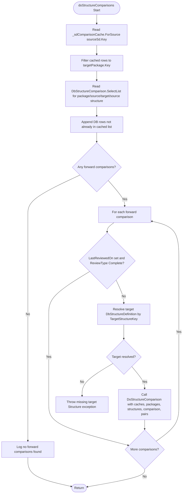

# FhirDbComparer.doStructureComparisons Specification

> **Status note (2026-06-04):** The entire body of
> `FhirDbComparerStructures.cs` (and its sibling
> `FhirDbComparerValueSets.cs`, `FhirDbComparerElements.cs`,
> `FhirDbComparerElementTypes.cs`,
> `FhirDbComparerValueSetConcepts.cs`) is currently wrapped in
> `#if false ... #endif` and is therefore **not part of the compiled
> binary**. The active structure-comparison pipeline runs through
> `StructureComparer.CompareStructures`
> (`src/Fhir.CodeGen.Comparison/CompareTool/StructureComparer.cs:85`),
> called from `FhirDbComparer.Compare`
> (`src/Fhir.CodeGen.Comparison/CompareTool/FhirDbComparer.cs:111`). This
> spec is retained as a reference for the dormant code, which is
> preserved in-source for possible re-activation; it does **not**
> describe the live execution path. See
> [`fhirdb-comparer-compare.md`](./fhirdb-comparer-compare.md) for the
> active orchestrator.

## Executive Summary

`doStructureComparisons` is a private hand-off method in `FhirDbComparerStructures.cs` that processes structure comparison records that already exist in memory or in the comparison database. In the current source, it does not discover target structures, does not create new forward comparisons, and does not perform fallback matching itself. It loads cached and persisted forward comparisons for one source structure and one target package, exits when none exist, skips comparisons already reviewed as complete, resolves each target structure by key, and delegates element-level analysis and relationship updates to `DoStructureComparison` (`FhirDbComparerStructures.cs:554-620`, `623-775`).

## Architecture Overview

This method now sits after comparison discovery, not before it. Active structure discovery is initiated by `FhirDbComparer.Compare`, which creates `StructureComparer` and calls `StructureComparer.CompareStructures` (`FhirDbComparer.cs:132-140`). `StructureComparer` builds package pairs, discovers direct or transitive comparison paths, creates `DbStructureComparison` records, and persists cached changes (`StructureComparer.cs:85-130`, `133-177`, `180-238`). `doStructureComparisons` only consumes comparisons that are already present in `_sdComparisonCache` or returned from `DbStructureComparison.SelectList`.

1. **Collect Existing Forward Comparisons**: Reads cached comparisons for `sourceSd.Key`, filtered to `targetPackage.Key`, then reads persisted rows for the same package/structure tuple.
2. **Merge Without Re-adding Duplicates**: Appends database rows that are not already present in the cached list.
3. **Return When Discovery Found Nothing**: Logs "No forward comparisons found ..." and exits without creating replacements.
4. **Delegate Detailed Comparison**: For each non-reviewed comparison, resolves the target structure and calls `DoStructureComparison` with the shared caches and package pair objects.

## Method Signature

```csharp
private void doStructureComparisons(
    DbFhirPackage sourcePackage,
    DbStructureDefinition sourceSd,
    DbFhirPackage targetPackage,
    FhirPackageComparisonPair forwardPair,
    FhirPackageComparisonPair reversePair)
```

### Parameters

- **`sourcePackage`**: Source FHIR package containing `sourceSd`.
- **`sourceSd`**: Source `DbStructureDefinition` whose existing forward comparisons are being processed.
- **`targetPackage`**: Target FHIR package used to filter comparisons.
- **`forwardPair`**: In-memory `FhirPackageComparisonPair` for the source-to-target direction; this type wraps source/target `DbFhirPackage` instances and exposes source/target package key and short-name helpers (`FhirPackageComparisonPair.cs:10-43`).
- **`reversePair`**: In-memory `FhirPackageComparisonPair` for the target-to-source direction, used by `DoStructureComparison` and inverse creation (`FhirDbComparerStructures.cs:633-640`, `778-827`).

## Detailed Algorithm

### Step 1: Load cached forward comparisons

The method starts with `_sdComparisonCache.ForSource(sourceSd.Key)`, filters the results to rows whose `TargetFhirPackageKey` equals `targetPackage.Key`, and materializes them as a list (`FhirDbComparerStructures.cs:561-564`).

### Step 2: Load persisted forward comparisons

It queries `DbStructureComparison.SelectList` using the current package comparison key, source package key, target package key, and source structure key (`FhirDbComparerStructures.cs:566-571`):

```csharp
DbStructureComparison.SelectList(
    _db,
    PackageComparisonKey: forwardPair.Key,
    SourceFhirPackageKey: sourcePackage.Key,
    TargetFhirPackageKey: targetPackage.Key,
    SourceStructureKey: sourceSd.Key);
```

### Step 3: Merge and exit if empty

Each database comparison is appended only when `forwardComparisons.Contains(c)` is false (`FhirDbComparerStructures.cs:573-580`). If the merged list is empty, the method logs that no forward comparisons were found for the source structure and target package, then returns immediately (`FhirDbComparerStructures.cs:582-587`). There is no in-method replacement generation or target discovery in this branch.

### Step 4: Process each remaining comparison

For every merged comparison (`FhirDbComparerStructures.cs:589-617`):

1. Skip when `LastReviewedOn != null` and `ReviewType == StructureReviewTypeCodes.Complete` (`FhirDbComparerStructures.cs:592-596`).
2. Resolve `TargetStructureKey` via `DbStructureDefinition.SelectSingle(_db, Key: forwardComparison.TargetStructureKey)` and throw if the target cannot be found (`FhirDbComparerStructures.cs:598-602`).
3. Call `DoStructureComparison`, passing `_sdComparisonCache`, `_edComparisonCache`, `_collatedTypeComparisonCache`, `_typeComparisonCache`, packages, structures, the forward comparison, and both package pairs (`FhirDbComparerStructures.cs:604-616`).

## Mermaid Workflow Diagram



## Dependencies & Interactions

### Core Dependencies

#### **Cache Operations**

- **`_sdComparisonCache.ForSource(sourceSd.Key)`** - `FhirDbComparerStructures.cs:561-564`
  - Supplies cached structure comparisons that are already known for the source structure.
  - The method filters these cached rows to the current target package.

- **Caches forwarded to `DoStructureComparison`** - `FhirDbComparerStructures.cs:604-616`
  - `_sdComparisonCache` tracks structure comparison additions/updates.
  - `_edComparisonCache` tracks element comparison changes.
  - `_collatedTypeComparisonCache` and `_typeComparisonCache` support element type comparison work delegated below this method.

#### **Database Operations**

- **`DbStructureComparison.SelectList(_db, ...)`** - `FhirDbComparerStructures.cs:566-571`
  - Parameters: `PackageComparisonKey`, `SourceFhirPackageKey`, `TargetFhirPackageKey`, and `SourceStructureKey`.
  - Returns existing persisted forward structure comparisons for this exact source/target context.

- **`DbStructureDefinition.SelectSingle(_db, Key: ...)`** - `FhirDbComparerStructures.cs:598-602`
  - Resolves each forward comparison's target structure before deep comparison.
  - Throws when the key cannot be resolved.

- **No target-discovery `DbStructureDefinition.SelectList` calls occur in `doStructureComparisons`**.
  - Current source/target discovery lives in `StructureComparer`: explicit mappings (`StructureComparer.cs:615-666`), same-id and same-url probes (`StructureComparer.cs:672-726`), same-name fallback when no target exists (`StructureComparer.cs:728-755`), inverse mappings (`StructureComparer.cs:757-807`), and no-map records (`StructureComparer.cs:867-884`).

#### **Core Processing Method**

- **`DoStructureComparison(...)`** - `FhirDbComparerStructures.cs:623-775`
  - Ensures or creates the inverse comparison (`FhirDbComparerStructures.cs:636-640`, `778-827`).
  - Runs element comparisons via `doElementComparisons` (`FhirDbComparerStructures.cs:642-656`).
  - Updates `IsIdentical` on forward and inverse records when necessary (`FhirDbComparerStructures.cs:658-669`).
  - Leaves reviewed records unchanged when `LastReviewedOn != null` and `ReviewType > StructureReviewTypeCodes.None` (`FhirDbComparerStructures.cs:671-676`).
  - Aggregates element relationships into structure relationships (`FhirDbComparerStructures.cs:678-686`, `848-943`).
  - Applies configured composite/type mapping overrides and builds the final user message (`FhirDbComparerStructures.cs:688-774`).

### Supporting Systems

#### **Type Mapping Infrastructure**

`doStructureComparisons` itself does not consult type mapping tables. `CodeGenTypeMapping` is used downstream in `DoStructureComparison` for `FhirTypeMappings.CompositeMappingOverrides` and `FhirTypeMappings.TryGetMapping` (`FhirDbComparerStructures.cs:688-725`) and in `invert` when building an inverse record (`FhirDbComparerStructures.cs:946-1021`).

#### **Data Models**

- **`DbStructureComparison`**: Existing comparison record consumed by this method; includes source/target keys, review state, relationships, identity flags, technical/user messages, and inverse linkage.
- **`DbStructureDefinition`**: Structure metadata. `doStructureComparisons` uses only the source instance passed in and a target resolved by key.
- **`DbFhirPackage`**: Package metadata used for filtering, logging, and delegation.
- **`FhirPackageComparisonPair`**: In-memory source/target package pair used by current structure comparison code, distinct from the persisted `DbFhirPackageComparisonPair` model (`FhirPackageComparisonPair.cs:10-43`).

## Data Models

### Input Structures

```csharp
DbFhirPackage sourcePackage { Key, ShortName, ... }

DbStructureDefinition sourceSd {
    Key,
    Name,
    Id,
    UnversionedUrl,
    VersionedUrl,
    Version,
    ...
}

DbFhirPackage targetPackage { Key, ShortName, ... }

FhirPackageComparisonPair forwardPair {
    SourcePackage,
    TargetPackage,
    SourcePackageKey,
    TargetPackageKey,
    SourcePackageShortName,
    TargetPackageShortName,
    ...
}

FhirPackageComparisonPair reversePair { ... }
```

### Consumed and Updated Structures

`doStructureComparisons` consumes existing `DbStructureComparison` rows rather than constructing new forward rows:

```csharp
DbStructureComparison {
    Key,
    PackageComparisonKey,
    SourceFhirPackageKey,
    TargetFhirPackageKey,
    SourceStructureKey,
    TargetStructureKey,
    SourceCanonicalVersioned,
    TargetCanonicalVersioned,
    SourceName,
    TargetName,
    CompositeName,
    Relationship,
    ConceptDomainRelationship,
    ValueDomainRelationship,
    LastReviewedOn,
    ReviewType,
    IsIdentical,
    TechnicalMessage,
    UserMessage,
    InverseComparisonKey,
}
```

`DoStructureComparison` may update `IsIdentical`, relationships, generated flags, technical messages, inverse linkage, and user messages. If an inverse comparison is missing, `findOrCreateInverse` creates one from the forward comparison and caches it (`FhirDbComparerStructures.cs:778-827`, `946-1021`).

### Type Mapping Structure

There is no type-mapping-driven creation phase in `doStructureComparisons`. Mapping records are applied only after a comparison has already been selected for deep processing, inside `DoStructureComparison` and `invert` (`FhirDbComparerStructures.cs:688-725`, `946-1021`).

## Error Handling

### Database Resolution Failures

```csharp
DbStructureDefinition targetSd = DbStructureDefinition.SelectSingle(
    _db,
    Key: forwardComparison.TargetStructureKey)
    ?? throw new Exception(
        $"Could not resolve target Structure with Key: {forwardComparison.TargetStructureKey} (`{forwardComparison.TargetCanonicalVersioned}`)");
```

This is the only explicit exception thrown by `doStructureComparisons` (`FhirDbComparerStructures.cs:598-602`).

### Error Categories

1. **Missing Target Structures**: A selected comparison with an unresolved `TargetStructureKey` throws before `DoStructureComparison`.
2. **Database Operation Failures**: Select operations may surface provider-level errors.
3. **Delegated Comparison Failures**: Element comparison, inverse creation, aggregation, or message generation errors occur inside `DoStructureComparison` or its callees.

### Resilience Patterns

- **Empty-list early return**: No existing comparisons means no work and no generated substitute (`FhirDbComparerStructures.cs:582-587`).
- **Reviewed-complete skip**: Human-reviewed complete comparisons are not reprocessed (`FhirDbComparerStructures.cs:592-596`).
- **Delegated reviewed guard**: `DoStructureComparison` also avoids relationship aggregation for any reviewed comparison whose review type is greater than `None` (`FhirDbComparerStructures.cs:671-676`).

## Performance Considerations

### Computational Complexity

- **Cache lookup/filter**: Linear in the number of cached comparisons for `sourceSd.Key`.
- **Database lookup**: One targeted `DbStructureComparison.SelectList` per source/target context.
- **Merge**: Linear over database rows, with `Contains` using the model's equality behavior.
- **Processing**: One target lookup and one `DoStructureComparison` call per non-skipped comparison.

### Optimization Strategies

1. **Cache-first collection**: Starts with `_sdComparisonCache` so pending in-memory changes can be included before database rows.
2. **Early termination**: Avoids target resolution and element comparison when no forward comparisons exist.
3. **Review-aware skip**: Avoids recalculating comparisons that are marked complete.
4. **Delegation to shared caches**: Passes all caches to `DoStructureComparison`, allowing lower layers to batch changes for persistence.

### Memory Usage

- The method materializes one merged `List<DbStructureComparison>` for the current source structure and target package.
- It does not allocate candidate target lists or generated forward-comparison records.
- Additional memory use comes from delegated element/type comparison work in `DoStructureComparison`.

## Usage Examples

### Existing Comparison Processing

```csharp
// Conceptual private invocation after comparison records already exist.
doStructureComparisons(
    sourcePackage,
    sourceSd,
    targetPackage,
    forwardPair,  // FhirPackageComparisonPair
    reversePair); // FhirPackageComparisonPair
```

The method expects discovery to have produced `DbStructureComparison` rows in `_sdComparisonCache` or the database. If neither location has a forward row for the source structure and target package, it only logs and returns.

### Active Pipeline Context

```csharp
StructureComparer sdComparer = new(_db, _loggerFactory);
sdComparer.CompareStructures(maxStepSize: maxStepSize, specificPairs: specificPairs);
```

This is the current active structure path from `FhirDbComparer.Compare` (`FhirDbComparer.cs:132-140`). `StructureComparer.CompareStructures` handles package-pair construction, discovery, comparison record creation, and persistence (`StructureComparer.cs:85-130`, `133-177`, `180-238`).

## Integration Notes

### Caller Context

- Active `FhirDbComparer.Compare` delegates structure work to `StructureComparer.CompareStructures` (`FhirDbComparer.cs:132-140`).
- `doStructureComparisons` is present in `FhirDbComparerStructures.cs` inside the file's disabled `#if false` region (`FhirDbComparerStructures.cs:17`, `1023`). Its current body should therefore be read as legacy/private orchestration code, not as the active discovery path.
- The body still passes `forwardPair.Key` as `PackageComparisonKey` (`FhirDbComparerStructures.cs:566-571`), while the visible in-memory `FhirPackageComparisonPair` type exposes source/target package keys rather than a persisted comparison-pair key (`FhirPackageComparisonPair.cs:10-43`).
- Discovery and forward comparison creation now happen upstream in `StructureComparer`, including direct neighbor paths and transitive paths (`StructureComparer.cs:207-238`, `604-884`).

### Cache Coordination

- `doStructureComparisons` reads `_sdComparisonCache` before querying the database (`FhirDbComparerStructures.cs:561-571`).
- It passes structure, element, collated-type, and element-type caches to `DoStructureComparison` (`FhirDbComparerStructures.cs:604-616`).
- `DoStructureComparison` marks changed records through the supplied structure cache (`FhirDbComparerStructures.cs:658-669`, `678-725`, `773-774`).

### Database Transaction Scope

- `doStructureComparisons` performs selects only; it does not insert, update, or delete rows directly.
- Persistence is handled by the owning comparison flow after cached changes are accumulated. In the active `StructureComparer` flow, `applyCachedChanges` inserts and updates cached structure, element, and element-type comparisons (`StructureComparer.cs:133-177`).

---
*Verified against commit `d02100974b2dc1b05ecf1af69c29095e6973f4c8` on `2026-06-04`.*
