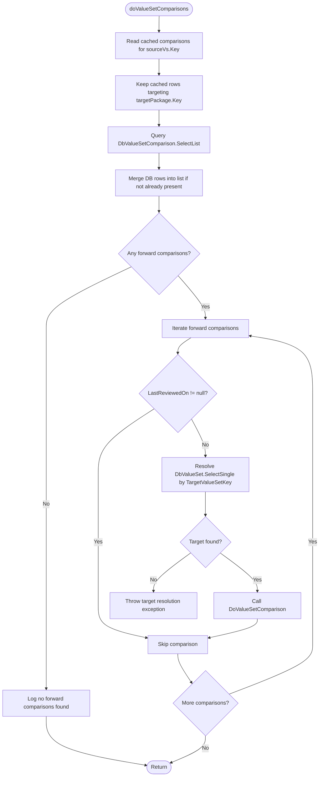

# FhirDbComparer.doValueSetComparisons Specification

> **Status note (2026-06-04):** The entire body of
> `FhirDbComparerValueSets.cs` (and its sibling
> `FhirDbComparerStructures.cs`, `FhirDbComparerElements.cs`,
> `FhirDbComparerElementTypes.cs`,
> `FhirDbComparerValueSetConcepts.cs`) is currently wrapped in
> `#if false ... #endif` and is therefore **not part of the compiled
> binary**. The active value-set comparison pipeline runs through
> `ValueSetComparer.CompareValueSets`
> (`src/Fhir.CodeGen.Comparison/CompareTool/ValueSetComparer.cs:100`),
> called from `FhirDbComparer.Compare`
> (`src/Fhir.CodeGen.Comparison/CompareTool/FhirDbComparer.cs:111`). This
> spec is retained as a reference for the dormant code, which is
> preserved in-source for possible re-activation; it does **not**
> describe the live execution path. See
> [`fhirdb-comparer-compare.md`](./fhirdb-comparer-compare.md) for the
> active orchestrator.

## Executive Summary

The `doValueSetComparisons` method is a private `FhirDbComparer` helper that consumes ValueSet comparison records that already exist in the in-memory cache or database, then delegates each unreviewed forward comparison to `DoValueSetComparison`. It no longer discovers equivalent target ValueSets by URL, name, or ID, and it does not create `DbValueSetComparison` records on the fly when none are found.

**Primary Purpose**: Re-run or complete pre-existing forward ValueSet comparisons from one FHIR package to another, skipping comparisons that have already been reviewed.

**File Location**: `src\Fhir.CodeGen.Comparison\CompareTool\FhirDbComparerValueSets.cs:428`

## Architecture Overview

### System Context
The method sits in the older `FhirDbComparer` comparison helper code and operates over comparison records prepared elsewhere:

- **Parent Component**: `FhirDbComparer` - database-backed comparison utilities and `DoValueSetComparison` implementation.
- **Active Caller Context**: `FhirDbComparer.Compare` constructs `ValueSetComparer`, and `ValueSetComparer.CompareValueSets` performs the current discovery/comparison pipeline. In current source, the only direct `doValueSetComparisons` call site is in disabled `#if false` legacy code in `FhirDbComparer.cs`.
- **Upstream Discovery**: ValueSet discovery and comparison-record creation now live in `ValueSetComparer.CompareValueSets` and its private helpers, not in this method.
- **Database Integration**: Reads existing `DbValueSetComparison` rows and resolves target `DbValueSet` rows from the SQLite-backed comparison database.
- **Caching Layer**: Reads `_vsComparisonCache` for already-loaded `DbValueSetComparison` records and passes both `_vsComparisonCache` and `_conceptComparisonCache` into `DoValueSetComparison`.

### Design Patterns
- **Cache-Aside Read**: Starts with cached comparisons, then supplements from the database.
- **Deduplicating Merge**: Adds database comparisons only when the merged list does not already contain the same record.
- **Delegation**: Leaves concept-level comparison, inverse-comparison handling, relationship aggregation, and messages to `DoValueSetComparison`.
- **Review Gate**: Treats `LastReviewedOn != null` as the sole skip condition for reviewed ValueSet comparisons.

## Method Signature

```csharp
private void doValueSetComparisons(
    DbFhirPackage sourcePackage,
    DbValueSet sourceVs,
    DbFhirPackage targetPackage,
    DbFhirPackageComparisonPair forwardPair,
    DbFhirPackageComparisonPair reversePair)
```

### Parameters

| Parameter | Type | Purpose |
|-----------|------|---------|
| `sourcePackage` | `DbFhirPackage` | The FHIR package containing the source ValueSet. |
| `sourceVs` | `DbValueSet` | The source ValueSet whose existing forward comparisons should be processed. |
| `targetPackage` | `DbFhirPackage` | The target FHIR package used to filter comparisons and resolve target ValueSets. |
| `forwardPair` | `DbFhirPackageComparisonPair` | Database comparison-pair record for the source-to-target package direction. |
| `reversePair` | `DbFhirPackageComparisonPair` | Database comparison-pair record for the target-to-source package direction, passed through to `DoValueSetComparison`. |

## Detailed Algorithm

### Phase 1: Load Cached and Persisted Forward Comparisons (Lines 435-454)

```mermaid
flowchart TD
    A[Start doValueSetComparisons] --> B[Read _vsComparisonCache.ForSource(sourceVs.Key)]
    B --> C[Filter cached records to targetPackage.Key]
    C --> D[Query DbValueSetComparison.SelectList]
    D --> E[Merge DB rows into cached list]
    E --> F[Deduplicate by Contains]
```

**Purpose**: Build the complete set of known forward `DbValueSetComparison` records for this source ValueSet and target package.

**Database filter**: The persisted query is constrained by `PackageComparisonKey`, `SourceFhirPackageKey`, `TargetFhirPackageKey`, and `SourceValueSetKey`.

### Phase 2: Exit When No Existing Forward Comparisons Are Available (Lines 456-461)

If the merged forward-comparison list is empty, the method logs:

```text
No forward comparisons found for {sourcePackage.ShortName}:{sourceVs.Name} (`{sourceVs.VersionedUrl}`) to {targetPackage.ShortName}
```

It then returns immediately. There is no fallback matching by `UnversionedUrl`, `Name`, or `Id`, and there is no automatic generation of new `DbValueSetComparison` records in this method.

### Phase 3: Iterate Each Existing Forward Comparison (Lines 463-485)

For each `DbValueSetComparison` in the merged list, the method applies a simple review gate:

```csharp
if (forwardComparison.LastReviewedOn != null)
{
    continue;
}
```

Unlike the structure-comparison flow, this ValueSet method does not inspect a review type or any additional review-state field.

### Phase 4: Resolve the Target ValueSet (Lines 471-473)

For every non-reviewed comparison, the method resolves the target with:

```csharp
DbValueSet targetVs = DbValueSet.SelectSingle(_db, Key: forwardComparison.TargetValueSetKey)
    ?? throw new Exception($"Could not resolve target ValueSet with Key: {forwardComparison.TargetValueSetKey} (`{forwardComparison.TargetCanonicalVersioned}`)");
```

A missing target is treated as a database consistency failure and terminates processing by throwing.

### Phase 5: Delegate Detailed Comparison Work (Lines 475-484)

The method calls `DoValueSetComparison(...)` with the two comparison caches, source and target packages, source and target ValueSets, the current forward comparison, and the forward/reverse package comparison pairs. Detailed concept comparisons, inverse-comparison creation or lookup, relationship aggregation, identical-code checks, and user-message generation happen inside `DoValueSetComparison`, not in `doValueSetComparisons` itself.

## Mermaid Workflow Diagram



## Dependencies & Interactions

### Directly Called Methods

| Method | Purpose | Current source |
|--------|---------|----------------|
| `_vsComparisonCache.ForSource(sourceVs.Key)` | Retrieves cached comparisons keyed by the source ValueSet. | `FhirDbComparerValueSets.cs:436` |
| `DbValueSetComparison.SelectList(...)` | Retrieves persisted forward comparisons for the package pair and source ValueSet. | `FhirDbComparerValueSets.cs:440` |
| `forwardComparisons.Contains(c)` | Avoids adding duplicate DB records to the working list. | `FhirDbComparerValueSets.cs:449` |
| `DbValueSet.SelectSingle(_db, Key: forwardComparison.TargetValueSetKey)` | Resolves the target ValueSet for a comparison record. | `FhirDbComparerValueSets.cs:472` |
| `DoValueSetComparison(...)` | Performs the detailed ValueSet and concept comparison workflow. | `FhirDbComparerValueSets.cs:475` |

### Not Called Here

| Method or behavior | Current status |
|--------------------|----------------|
| `DbValueSet.SelectList(..., UnversionedUrl: ...)` | Not used by `doValueSetComparisons`; URL/name/ID discovery moved upstream. |
| Creating new `DbValueSetComparison` records for inferred matches | Not performed by this method. |
| Review-type sub-checks | Not performed; `LastReviewedOn != null` is the only reviewed skip condition. |

### Adjacent Public Helper

`AggregateValueSetRelationships(DbValueSetComparison vsComparison)` starts at `FhirDbComparerValueSets.cs:490`. It is separate from `doValueSetComparisons`: it resolves the source and target ValueSets for an existing comparison, throws if either cannot be found, and delegates to `aggregateValueSetRelationships(...)`.

### Called By / Pipeline Context

- `FhirDbComparer.Compare` currently delegates ValueSet processing to `ValueSetComparer.CompareValueSets`.
- `ValueSetComparer.CompareValueSets` orders package pairs, discovers targets through `buildNeighborComparisonPaths` or `discoverTransitivePaths`, runs direct or transitive comparisons, and flushes cache changes through `applyCachedChanges`.
- The direct source reference to `doValueSetComparisons` appears in disabled legacy code (`#if false`) in `FhirDbComparer.cs`, so this specification describes the method body as written rather than an active production call path.

### Cache Dependencies

- **`_vsComparisonCache`**: Supplies cached `DbValueSetComparison` records and is passed into `DoValueSetComparison` for updates.
- **`_conceptComparisonCache`**: Passed into `DoValueSetComparison` for concept-level comparison additions and updates.

## Data Models

### Input Models

#### DbValueSet
```csharp
public class DbValueSet {
    public int Key { get; set; }
    public string Id { get; set; }
    public string VersionedUrl { get; set; }
    public string UnversionedUrl { get; set; }
    public string Name { get; set; }
    public string Version { get; set; }
    public int ConceptCount { get; set; }
    public int ActiveConcreteConceptCount { get; set; }
    // ... additional metadata properties
}
```

#### DbFhirPackage
```csharp
public class DbFhirPackage {
    public int Key { get; set; }
    public string Name { get; set; }
    public string PackageId { get; set; }
    public string PackageVersion { get; set; }
    public string ShortName { get; set; }
    public string FhirVersionShort { get; set; }
    // ... additional package metadata
}
```

#### DbFhirPackageComparisonPair
```csharp
public class DbFhirPackageComparisonPair {
    public int Key { get; set; }
    public int SourcePackageKey { get; set; }
    public int TargetPackageKey { get; set; }
    // ... additional package-pair metadata
}
```

### Output / Working Models

#### DbValueSetComparison
```csharp
public class DbValueSetComparison {
    public int Key { get; set; }
    public int PackageComparisonKey { get; set; }

    public int SourceFhirPackageKey { get; set; }
    public int TargetFhirPackageKey { get; set; }
    public int SourceValueSetKey { get; set; }
    public int? TargetValueSetKey { get; set; }

    public string SourceCanonicalVersioned { get; set; }
    public string TargetCanonicalVersioned { get; set; }
    public CMR? Relationship { get; set; }
    public bool? IsIdentical { get; set; }
    public bool? CodeLiteralsAreIdentical { get; set; }

    public string? TechnicalMessage { get; set; }
    public string? UserMessage { get; set; }
    public string? LastReviewedBy { get; set; }
    public DateTime? LastReviewedOn { get; set; }
}
```

The method does not construct these records; it only reads, filters, merges, skips, and passes existing instances to `DoValueSetComparison`.

## Error Handling

### Exception Scenarios

1. **Target ValueSet Resolution Failure** (`FhirDbComparerValueSets.cs:472`):
   ```csharp
   DbValueSet targetVs = DbValueSet.SelectSingle(_db, Key: forwardComparison.TargetValueSetKey)
       ?? throw new Exception($"Could not resolve target ValueSet with Key: {forwardComparison.TargetValueSetKey} (`{forwardComparison.TargetCanonicalVersioned}`)");
   ```
   **Cause**: A comparison row points to a target ValueSet key that cannot be resolved.
   **Impact**: The method throws and stops processing.
   **Recovery**: Repair or regenerate the comparison data so each comparison references a valid target ValueSet.

### Defensive Behavior

- **Empty Comparison Set**: Logs and returns without treating the absence of forward comparisons as an error.
- **Reviewed Comparison Set**: Silently skips any comparison with `LastReviewedOn != null`.
- **Deduplication**: Prevents duplicate entries in the working list when the same comparison is already present in cache.

## Performance Considerations

### Algorithmic Complexity

- **Cache Filtering**: Linear in cached comparisons for the source ValueSet returned by `_vsComparisonCache.ForSource(sourceVs.Key)`.
- **Database Query**: One constrained `DbValueSetComparison.SelectList` call per source ValueSet / target package / forward pair invocation.
- **Merge**: Linear in the persisted comparison count, with duplicate checks performed through `List.Contains`.
- **Target Resolution**: One `DbValueSet.SelectSingle` call for each non-reviewed comparison.

### Optimization Strategies

1. **No Discovery Work**:
   - Avoids broad target ValueSet searches by URL, name, or ID.
   - Processes only known comparison records.

2. **Review-Based Skipping**:
   - Preserves reviewed results by skipping records where `LastReviewedOn` is set.

3. **Lazy Target Resolution**:
   - Resolves target ValueSets only after confirming the comparison is not reviewed.

4. **Delegated Cache Updates**:
   - `DoValueSetComparison` owns downstream cache mutations, allowing this method to stay focused on selection and orchestration.

### Memory Usage

- **Working List**: Holds the merged forward comparison list for one source ValueSet and one target package.
- **No Potential Target List**: The current method does not allocate candidate lists for URL/name/ID matching.
- **Cache Reuse**: Uses existing comparison caches rather than creating local cache instances.

### Scalability Notes

The method scales primarily with the number of existing comparisons for a source ValueSet in a target package. Any cost associated with discovering matches is now borne by `ValueSetComparer.CompareValueSets` and its helper methods before this orchestration step would be relevant.

## Integration Points

### Database Schema Dependencies

- **ValueSetComparisons Table**: Must support filtering by package comparison, source package, target package, and source ValueSet key.
- **ValueSets Table**: Must resolve target rows by primary key for every non-reviewed comparison.
- **ConceptComparisons Table**: Used downstream by `DoValueSetComparison` and related aggregation methods.

### External Service Dependencies

- **SQLite Database**: Persistent storage for ValueSets, package pairs, ValueSet comparisons, and concept comparisons.
- **No FHIR Package Registry Calls**: This method does not contact registries or package services.
- **No Terminology Service Calls**: This method does not expand or validate terminology directly.

## Quality Assurance

### Validation Rules

1. **Comparison Availability**: No comparison records means the method logs and exits without generating replacements.
2. **Referential Integrity**: Every non-reviewed comparison must resolve to a target `DbValueSet` by `TargetValueSetKey`.
3. **Reviewed Data Preservation**: Any comparison with `LastReviewedOn != null` must remain untouched by this method.
4. **Pair Direction Correctness**: `forwardPair` is used for persisted forward comparison lookup; `reversePair` is passed to `DoValueSetComparison` for inverse-direction handling.

### Testing Considerations

- **Cache + DB Merge**: Verify cached and persisted comparisons are merged without duplicate processing.
- **Empty Path**: Verify zero comparisons logs the no-forward-comparisons message and returns.
- **Reviewed Skip**: Verify `LastReviewedOn != null` skips comparison processing regardless of other review metadata.
- **Target Resolution Failure**: Verify a missing `TargetValueSetKey` target throws the documented exception.
- **Delegation**: Verify each non-reviewed comparison calls `DoValueSetComparison` with both `DbFhirPackageComparisonPair` arguments and the shared caches.

## Future Enhancement Opportunities

1. **Clarify Lifecycle**: Remove, re-enable, or relocate this helper if the legacy `FhirDbComparer` pathway remains inactive.
2. **Explicit Deduplication Key**: Replace `List.Contains` with key-based deduplication if equality semantics are not guaranteed across cache and DB instances.
3. **Nullable Target Handling**: Add an explicit guard before target resolution if no-map comparison rows with null `TargetValueSetKey` should be supported here.
4. **Structured Logging**: Convert interpolated log text to structured logging fields for source package, source ValueSet, and target package.
5. **Caller Documentation**: Keep this spec synchronized with `ValueSetComparer.CompareValueSets` if active ValueSet comparison orchestration continues to live there.

---
*Verified against commit `d02100974b2dc1b05ecf1af69c29095e6973f4c8` on `2026-06-04`.*

