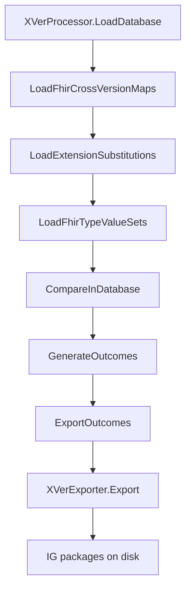
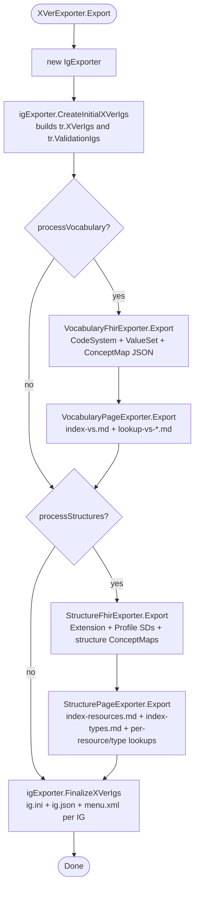

# XVerExporter.Export Specification

## Executive Summary

`XVerExporter.Export` is the primary entry point for materializing the
cross-version FHIR artifacts the pipeline produces (Implementation Guides,
StructureDefinitions, ValueSets/CodeSystems, ConceptMaps, page content)
onto disk. It does **not** compute outcomes — those are already in the
SQLite comparison database by the time it runs — it walks the
already-computed `DbStructureOutcome` / `DbValueSetOutcome` /
`DbValueSetConceptOutcome` rows and emits the FHIR JSON and IG markdown
for each one.

`XVerExporter.Export` is a thin orchestrator. It instantiates an
`IgExporter` to build the IG package skeletons (one cross-version IG per
package pair, plus one validation IG per allowed package), then dispatches
to four content exporters that fill those skeletons with FHIR resources
and page content:

- `VocabularyFhirExporter` — writes CodeSystem, ValueSet, and ConceptMap
  JSON for each cross-version IG.
- `VocabularyPageExporter` — writes the value-set lookup and index
  markdown pages for each cross-version IG.
- `StructureFhirExporter` — writes Extension and Profile
  StructureDefinitions plus the supporting ConceptMaps for resource,
  type, and element mappings.
- `StructurePageExporter` — writes the resource/type lookup index pages
  and per-resource/per-type lookup pages.

`IgExporter.FinalizeXVerIgs` then writes `ig.ini`, `ig.json`, and
`menu.xml` for each tracked IG, closing out the package skeletons.

**File:** `src/Fhir.CodeGen.Comparison/Exporter/XVerExporter.cs:63`
**Class:** `XVerExporter` (in `Fhir.CodeGen.Comparison.Exporter`)
**Complexity:** Low for `XVerExporter.Export` itself (~55 lines); the
delegated component exporters together total ~8,300 lines of code.

## Architecture Overview

### Pipeline position



`XVerExporter.Export` is the seventh and final step of the cross-version
pipeline. It assumes the comparison database is loaded and the outcome
tables (`DbStructureOutcome`, `DbValueSetOutcome`,
`DbValueSetConceptOutcome`) are populated. It does not perform any
comparison or outcome generation.

### Component layout

```text
XVerExporter (orchestrator)
├── IgExporter
│   ├── CreateInitialXVerIgs  → builds package pair list, creates
│   │                            per-pair XVer IGs and per-package
│   │                            validation IGs, returns tracking record
│   └── FinalizeXVerIgs        → writes ig.ini, ig.json, menu.xml
├── VocabularyFhirExporter.Export(tr)
│       → per-IG: CodeSystem JSON, ValueSet JSON, ConceptMap JSON
├── VocabularyPageExporter.Export(tr)
│       → per-IG: index-vs.md, lookup-vs-*.md
├── StructureFhirExporter.Export(tr)
│       → per-IG: Extension/Profile StructureDefinitions, structure
│         ConceptMaps (resource/type/element maps)
└── StructurePageExporter.Export(tr)
        → per-IG: resource and type lookup index pages,
          per-resource/per-type lookup pages
```

### Core dependencies

- **Database layer:** `IDbConnection` (SQLite) holding the populated
  outcome tables produced by `GenerateOutcomes`.
- **Configuration:** `ConfigXVer` (output paths, cross-version source
  path, version overrides, per-FHIR-version export flags
  `ExportR2`..`ExportR6`, `XverArtifactVersion`, `XverIncludeScripts`).
- **FHIR libraries:** `Hl7.Fhir.Model`, `Hl7.Fhir.Serialization`.
- **Outcome readers:** `DbStructureOutcome`, `DbValueSetOutcome`,
  `DbValueSetConceptOutcome`, and the lower-level `DbStructureDefinition`
  / `DbElement` / `DbElementType` / `DbValueSet` rows for resolving
  source and target details.

## Method Signature

```csharp
public void Export(
    bool includeIgScripts = true,
    bool processVocabulary = true,
    bool processStructures = true,
    int? maxStepSize = null,
    HashSet<(FhirReleases.FhirSequenceCodes s, FhirReleases.FhirSequenceCodes t)>? specificPairs = null)
```

### Parameters

| Parameter | Default | Purpose |
|---|---|---|
| `includeIgScripts` | `true` | Whether `IgExporter` should emit publisher batch/shell scripts alongside the IG sources. Forwarded to `IgExporter.CreateInitialXVerIgs`. |
| `processVocabulary` | `true` | When `true`, run `VocabularyFhirExporter.Export` and `VocabularyPageExporter.Export`. |
| `processStructures` | `true` | When `true`, run `StructureFhirExporter.Export` and `StructurePageExporter.Export`. |
| `maxStepSize` | `null` (= all) | Forwarded to `IgExporter.CreateInitialXVerIgs`. Limits how far apart (in package-list index) two FHIR versions may be while still producing a cross-version IG. Defaults to `_packages.Count - 1` (i.e. every pair). |
| `specificPairs` | `null` (= all) | Forwarded to `IgExporter.CreateInitialXVerIgs`. When non-null, only the listed `(source, target)` sequence pairs are emitted. |

### Constructor

```csharp
public XVerExporter(IDbConnection db, ConfigXVer config)
```

- `_outputPath` is taken from `config.OutputDirectory`.
- `_crossVersionSourcePath` is taken from `config.CrossVersionMapSourcePath`
  (null if empty); this is where `xver-package-config.json` and
  `igParameters.json` are read from later by `IgExporter`.
- `_crossDefinitionVersion` defaults to `config.XverArtifactVersion`, or
  `"0.1.0"` if that's empty. `IgExporter`'s constructor may later
  override this from the on-disk `xver-package-config.json` if the
  configured version was empty.
- `_versionSpecificExtBehavior` is fixed to `ShortVersion`
  (XVerExporter.cs:45).
- `_versionSpecificExport` is fixed to `TargetVersion`
  (XVerExporter.cs:46). This is read by the vocabulary and structure
  exporters to decide which `ConceptMapToR3` / `ConceptMapToR4`
  serialization shims to apply when emitting back-version content.

### Exceptions

`XVerExporter.Export` itself does not throw. Failures originate in the
component exporters — see *Error Handling* below.

## Detailed Algorithm

The body of `XVerExporter.Export` is small enough to quote verbatim
(`XVerExporter.cs:69-118`):

1. **Construct `IgExporter`** with `_db`, `_loggerFactory`, `_outputPath`,
   `_crossVersionSourcePath`, `this` (the `XVerExporter` instance, so the
   child exporters can read its `_crossDefinitionVersion` and version
   knobs), and `_config`.
2. **Call `igExporter.CreateInitialXVerIgs(includeIgScripts, maxStepSize, specificPairs)`**
   (`IgExporter.cs:610`). This builds the package list, builds the
   `(source, target)` pair list with the stepped algorithm described
   below, and emits one `XVerIgExportTrackingRecord` per cross-version
   pair plus one `ValidationIgExportTrackingRecord` per allowed package,
   wrapped in an `XVerExportTrackingRecord`.
3. **Vocabulary phase (if `processVocabulary`):**
   1. Construct `VocabularyFhirExporter(this, _db, _loggerFactory)` and
      call `Export(tr)` (`VocabularyFhirExporter.cs:43`). For each
      cross-version IG: emit CodeSystems, ValueSets, and ConceptMaps.
   2. Construct `VocabularyPageExporter(this, _db, _loggerFactory)` and
      call `Export(tr)` (`VocabularyPageExporter.cs:46`). For each
      cross-version IG: emit `index-vs.md` and per-ValueSet
      `lookup-vs-*.md` pages.
4. **Structure phase (if `processStructures`):**
   1. Construct `StructureFhirExporter(this, _db, _loggerFactory)` and
      call `Export(tr)` (`StructureFhirExporter.cs:144`). For each
      cross-version IG: cache target-side Extension `value[x]` types and
      target-side canonical resource names; build a per-pair
      `PackagePairStructureMappingTracker` from `DbStructureOutcome`
      rows; then emit Extension and Profile StructureDefinitions plus
      the ConceptMaps that capture the structure/type/element mappings.
      When a non-`Basic` source maps onto the target `Basic.code` element,
      it also profiles `Basic.code` by emitting `Basic.code.coding` slices
      (`StructureFhirExporter.cs:1409-1499`).
   2. Construct `StructurePageExporter(this, _db, _loggerFactory)` and
      call `Export(tr)` (`StructurePageExporter.cs:100`). For each
      cross-version IG: emit `index-resources.md`, `index-types.md`,
      per-resource lookup pages, and per-type lookup pages.
5. **Call `igExporter.FinalizeXVerIgs(tr)`** (`IgExporter.cs:686`). For
   each tracked XVer IG, write `ig.ini`, `ig.json`, and `menu.xml`. For
   each tracked validation IG, write the validation-example bundle plus
   `ig.ini`, `ig.json`, and `menu.xml`.

The four content exporters all take the same `XVerExportTrackingRecord`
argument and iterate `tr.XVerIgs`. They never iterate validation IGs.

### `IgExporter.CreateInitialXVerIgs` package-pair generation

This is the only non-trivial scheduling decision in the pipeline and
worth surfacing here because every downstream exporter walks the
resulting pair list (`IgExporter.cs:610-684`):

1. Load `_packages` via `DbFhirPackage.SelectList(..., orderByProperties: [nameof(DbFhirPackage.PackageVersion)])`.
2. `maxStepSize ??= _packages.Count - 1`.
3. For `stepSize` in `1..maxStepSize`:
   - For each `i` in `0..(_packages.Count - stepSize - 1)`:
     - `sourcePackage = _packages[i]`, `targetPackage = _packages[i + stepSize]`.
     - If `_allowedExportVersions` contains `targetPackage.DefinitionFhirSequence`
       *and* (`specificPairs` is null or contains the forward pair):
       append `FhirPackageComparisonPair(sourcePackage, targetPackage)`.
     - If `_allowedExportVersions` contains `sourcePackage.DefinitionFhirSequence`
       *and* (`specificPairs` is null or contains the reverse pair):
       append `FhirPackageComparisonPair(targetPackage, sourcePackage)`.
4. For each pair in the resulting list, call `createInitialXVerIg(pair, includeScripts)`.
   Each `createInitialXVerIg` (`IgExporter.cs:1830`) also seeds a per-IG
   `.gitignore` at the IG root, copied from
   `<crossVersionSourcePath>/input/ig-support/gitignore.txt` when that file
   exists and the destination has none (`IgExporter.cs:1869-1880`).
5. Build `targetFhirVersions` from `specificPairs.t` (filtered by
   `_allowedExportVersions`) if `specificPairs` is non-null.
6. For each package in `_packages`: skip unless it's in
   `_allowedExportVersions` (and in `targetFhirVersions` when filtering);
   otherwise call `createInitialValidationIg(package, includeScripts)`.

The stepped algorithm means closer-version pairs are emitted first
within the tracking record's `XVerIgs` list. Downstream exporters
preserve that order.

### `IgExporter` configuration loading

The `IgExporter` constructor (`IgExporter.cs:437-546`) does three
things relevant to `Export`:

1. Populates `_allowedExportVersions` from `config.ExportR2`..`ExportR6`.
   Versions whose flag is false are silently excluded from both the
   cross-version IG list and the validation IG list.
2. Calls `loadIgParams()` and `loadPackageExportConfig()`, which read
   `<_crossVersionSourcePath>/input/ig-support/igParameters.json` and
   `xver-package-config.json` respectively if those files exist. Missing
   files are silently ignored (the IG ships with default parameters).
3. If `_xverPackageExportConfig?.PackageVersion` is set *and* the
   user-supplied `config.XverArtifactVersion` was empty, overrides
   `_exporter._crossDefinitionVersion` with the on-disk value.
4. If `_xverDependencies` is still empty after loading, falls back to a
   hard-coded default trio: `hl7.terminology@7.1.0`,
   `hl7.fhir.uv.extensions@5.3.0`, `hl7.fhir.uv.tools@1.1.2`
   (`IgExporter.cs:515-543`). These appear as IG dependencies in the
   generated `ig.json`.

## Mermaid Workflow Diagram



## Data Models

### Database row types read

The exporters read from the outcome tables filled by `GenerateOutcomes`:

```csharp
class DbStructureOutcome {
    int SourceFhirPackageKey;
    int TargetFhirPackageKey;
    int? SourceStructureKey;
    int? TargetStructureKey;
    string SourceName;
    string SourceId;
    string? TargetName;
    string? TargetId;
    FhirArtifactClassEnum SourceArtifactClass;
    FhirArtifactClassEnum? TargetArtifactClass;
    // … plus the canonical URL / outcome category / generated-name fields
}

class DbValueSetOutcome {
    int SourceFhirPackageKey;
    int TargetFhirPackageKey;
    int SourceValueSetKey;
    int? TargetValueSetKey;
    string SourceId;
    string SourceCanonicalVersioned;
    string SourceCanonicalUnversioned;
    string? TargetId;
    string? TargetCanonicalVersioned;
    string? TargetCanonicalUnversioned;
    string SourceName;
    string? TargetName;
    string? GenName;
    string? GenLongId;
    string? ConceptMapName;
    string? ConceptMapFileName;
    bool RequiresXVerDefinition;
    // …
}

class DbValueSetConceptOutcome {
    int ValueSetOutcomeKey;
    string SourceSystem;
    string SourceCode;
    string? SourceDisplay;
    string? TargetSystem;
    string? TargetCode;
    string? TargetDisplay;
    bool RequiresXVerDefinition;
    // …
}
```

### Tracking-record types

`IgExporter.cs:28-163` defines the in-memory bookkeeping the four
content exporters write into:

```csharp
class XVerExportTrackingRecord {
    List<XVerIgExportTrackingRecord> XVerIgs;       // one per package pair
    List<ValidationIgExportTrackingRecord> ValidationIgs; // one per allowed package
}

class XVerIgExportTrackingRecord {
    required FhirPackageComparisonPair PackagePair;
    required string PackageId;
    string PackageUrl => $"http://hl7.org/fhir/uv/xver/ImplementationGuide/{PackageId}";

    string? IgRootDir, InputDir, IncludesDir, PageContentDir;
    string? VocabularyDir, VocabMapDir, ExtensionDir, ProfileDir;
    string? ResourceMapDir, ElementMapDir;

    XVerIgFileRecord? IgIndexFile;
    List<XVerIgFileRecord> ResourceLookupFiles, TypeLookupFiles,
                           VsPageContentFiles, XVerSourcePageContentFiles,
                           CodeSystemFiles, ValueSetFiles,
                           VsConceptMapFiles, ExtensionFiles, ProfileFiles,
                           ResourceMapFiles, TypeMapFiles, ElementMapFiles;

    Dictionary<int, List<EdOutcomeMapTargetRecord>> EdOutcomeMapTargets;
}

class ValidationIgExportTrackingRecord {
    required DbFhirPackage Package;
    required string PackageId;
    string? IgRootDir, InputDir, IncludesDir, PageContentDir;
    XVerIgFileRecord? IgIndexFile;
    List<XVerIgFileRecord> XVerSourcePageContentFiles;
}
```

The content exporters add file records to these lists as they write
files; `FinalizeXVerIgs` later turns the lists into `package.json`
entries via `XVerIgExportTrackingRecord.AsPackageContents()`.

### `FhirPackageComparisonPair`

In-memory record that pairs a `DbFhirPackage` source with a
`DbFhirPackage` target and exposes:

- `SourcePackage` / `TargetPackage`
- `SourcePackageKey` / `TargetPackageKey`
- `SourceFhirSequence` / `TargetFhirSequence` (FHIR release codes)
- `SequencePair` — `(source, target)` tuple used as a dictionary key
  inside `StructureFhirExporter._resourceReferenceLookup`

## Output Directory Structure

All output is rooted at `_outputPath` (= `config.OutputDirectory`). For
each `XVerIgExportTrackingRecord`, `IgExporter` creates a directory tree
roughly of the form:

```text
{OutputDirectory}/
├── fhir/                                          # set up by IgExporter
│   ├── hl7.fhir.uv.xver-r4.r5/                   # one tree per cross-version pair
│   │   ├── ig.ini
│   │   ├── input/
│   │   │   ├── ImplementationGuide-*.json
│   │   │   ├── includes/menu.xml
│   │   │   ├── pagecontent/
│   │   │   │   ├── index-vs.md                   # VocabularyPageExporter
│   │   │   │   ├── lookup-vs-*.md                # VocabularyPageExporter
│   │   │   │   ├── index-resources.md            # StructurePageExporter
│   │   │   │   ├── index-types.md                # StructurePageExporter
│   │   │   │   └── lookup-{resource|type}-*.md   # StructurePageExporter
│   │   │   ├── vocabulary/
│   │   │   │   ├── CodeSystem-*.json             # VocabularyFhirExporter
│   │   │   │   └── ValueSet-*.json               # VocabularyFhirExporter
│   │   │   ├── vocab-maps/
│   │   │   │   └── ConceptMap-*.json             # VocabularyFhirExporter
│   │   │   ├── extensions/
│   │   │   │   └── StructureDefinition-ext-*.json # StructureFhirExporter
│   │   │   ├── profiles/
│   │   │   │   └── StructureDefinition-*.json    # StructureFhirExporter
│   │   │   ├── resource-maps/
│   │   │   │   └── ConceptMap-*.json             # StructureFhirExporter
│   │   │   └── element-maps/
│   │   │       └── ConceptMap-*.json             # StructureFhirExporter
│   │   └── package.json
│   ├── hl7.fhir.uv.xver-r5.r4/                   # reverse direction
│   └── hl7.fhir.uv.xver-validation-r5/           # per-version validation IG
└── ...
```

The exact directory and file naming is owned by `IgExporter`; the
content exporters only emit into the per-IG sub-directories listed on
their `XVerIgExportTrackingRecord`. Optional publisher scripts (when
`includeIgScripts == true`) are emitted alongside `ig.ini`.

## Cross-Version Mapping Outcome Categories

`StructureFhirExporter` and `VocabularyFhirExporter` consume mapping
outcomes that were classified by `GenerateOutcomes`. The authoritative
enums live in
`src/Fhir.CodeGen.Comparison/Models/DbOutcomeClasses.cs` —
`OutcomeValueSetActionCodes`, `OutcomeValueSetConceptActionCodes`,
`OutcomeStructureActionCodes`, `OutcomeElementActionCodes`. The
deep-dive of how those values are assigned (and the decision tree that
produces them) lives in
[`xver-generate-outcomes.md`](./xver-generate-outcomes.md); each
exporter's behavior is then a straightforward switch on the outcome
value, which the per-exporter sections above describe in their
algorithm bullets.

`xver-export-outcomes.md` covers the pipeline-level decisions that drive
which exporters run; this spec covers what each exporter does given
those decisions.

## Cross-Version Cardinality Extensions

Alongside the data-type extensions above, the structure exporters emit
**cardinality-only** extensions: generated extensions that carry the extra
repetitions a narrower target element cannot hold. These flow from the
`DbElementOutcome.RequiresCardinalityDefinition` / `RequiresCardinalitySlice`
flags and the per-target `DbElementOutcomeTarget.CardinalityContext*` fields
produced by `GenerateOutcomes` (see
[`xver-generate-outcomes.md`](./xver-generate-outcomes.md) for how those rows
are computed).

- **Extension emission.** `StructureFhirExporter.exportExtensions`
  (`StructureFhirExporter.cs:2245-2428`) runs a pass that selects
  `DbElementOutcome` rows with `RequiresCardinalityDefinition == true`
  (`StructureFhirExporter.cs:2317-2325`) and emits an Extension
  StructureDefinition for each, in addition to the `RequiresExtensionDefinition`
  (data-type) pass. The extension's legal `Context` is built from
  `DbElementOutcome.GetCombinedContexts()`, which unions the data-type and
  cardinality contexts (`StructureFhirExporter.cs:2364-2370`;
  `DbOutcomeClasses.cs:602-630`).
- **Profile-side constraint.** When an element needs a cardinality extension
  but *not* a data-type extension
  (`RequiresCardinalityDefinition && !RequiresExtensionDefinition`), the
  profile gains an `xvpc-*` warning constraint asserting that the cardinality
  extension's presence implies the targeted element exists
  (`StructureFhirExporter.cs:1717-1737`).
- **Element ConceptMap.** `addMappedElementsToElementCm`
  (`StructureFhirExporter.cs:463-767`) emits a second ConceptMap target when a
  target row's `CardinalityContextElementId` differs from its `TargetElementId`
  (`StructureFhirExporter.cs:582-619`), recording where the cardinality
  extension attaches relative to the primary mapping.
- **Page content.** `StructurePageExporter` surfaces the same information in
  the per-resource/per-type lookup tables: it renders a cardinality target link
  when `RequiresCardinalityDefinition` and the cardinality context element
  differs from the target element (`StructurePageExporter.cs:442-459`), lists
  the cardinality extension in the target column alongside data-type extensions
  (`StructurePageExporter.cs:520-543`), and treats `RequiresCardinalitySlice`
  like `RequiresSliceDefinition` when emitting slice rows
  (`StructurePageExporter.cs:545-547`).

## Error Handling

`XVerExporter.Export` itself contains no error handling; the component
exporters raise exceptions on missing tracking-record state. Notable
sites:

- `StructureFhirExporter.Export` throws if the target package's
  `Extension` complex type, or the `Extension.value[x]` element, cannot
  be located in the database (`StructureFhirExporter.cs:159, 170`). This
  effectively prevents extension generation for any target package that
  was not loaded as a FHIR core package.
- `VocabularyFhirExporter.exportConceptMaps` throws when
  `igTr.VocabMapDir is null` (`VocabularyFhirExporter.cs:73`); the
  directory should have been populated by `IgExporter.createInitialXVerIg`
  prior to dispatch.
- `VocabularyPageExporter.exportVsLookupPages` /
  `exportVsIndexPage` throw when `igTr.PageContentDir is null`
  (`VocabularyPageExporter.cs:63, 196`).
- `IgExporter.XVerIgFileRecord.GetName` throws `"Name: {nameRequest} has
  more than 100 uses!"` if a single export emits more than 100 IG files
  whose preferred name collides (`IgExporter.cs:100`). This guards
  against unbounded retry loops in name disambiguation.
- `IgExporter.loadIgParams` / `loadPackageExportConfig` catch and log
  their own exceptions; a malformed `igParameters.json` or
  `xver-package-config.json` will produce an error log entry but will
  not abort the export.

### Known limitations

- The export honors the per-version flags `ExportR2`..`ExportR6` from
  `ConfigXVer`. Packages whose FHIR sequence is not in
  `_allowedExportVersions` are silently excluded from both cross-version
  IGs and validation IGs, regardless of whether outcomes for them exist
  in the database (`IgExporter.cs:460-488, 631-675`).
- All four content exporters skip outcomes whose source or target
  canonical URL is in `XVerProcessor._exclusionSet` (e.g.
  `ucum-units`, `all-languages`, `mimetypes`, `timezones`). See
  `VocabularyFhirExporter.cs:94-95, 117-118`,
  `VocabularyPageExporter.cs:89-93, 240-244`.

## Integration Points

### CLI / API entry path

```text
fhir-codegen ... xver export    (or  "outcomes"  for the full final pair)
  → Program.DoXVer                                            (Program.cs:~345)
    → XVerProcessor.ProcessCommand("export")                  (XVerProcessor.cs:256)
      → XVerProcessor.ExportOutcomes(...)                     (XVerProcessor.cs:557)
        → new XVerExporter(_db.DbConnection, _config)         (XVerProcessor.cs:573)
        → exporter.Export(includeIgScripts, processVocabulary,
                          processStructures, maxStepSize, specificPairs)
                                                              (XVerExporter.cs:63)
```

`XVerProcessor.ExportOutcomes` is the orchestration layer that turns its
own `artifactFilter` argument into the `processVocabulary` /
`processStructures` boolean pair passed to `XVerExporter.Export`
(`XVerProcessor.cs:576-609`). See
[`xver-export-outcomes.md`](./xver-export-outcomes.md) for the
artifact-filter dispatch table.

### Generated package ecosystem

Each cross-version IG produced by this pipeline targets the HL7
Implementation Guide format and is publishable by the standard FHIR IG
publisher. The trio of default IG dependencies
(`hl7.terminology@7.1.0`, `hl7.fhir.uv.extensions@5.3.0`,
`hl7.fhir.uv.tools@1.1.2`) is hard-coded as a fallback in
`IgExporter.cs:515-543` but is overridden by
`<crossVersionSourcePath>/input/ig-support/xver-package-config.json`
when that file is present.

## Performance Considerations

### Order of magnitude

- `XVerExporter.Export` does a fixed amount of work itself (object
  construction + five method dispatches); all real cost is in the
  component exporters.
- `IgExporter.CreateInitialXVerIgs` is `O(_packages.Count ^ 2)` in the
  worst case (default `maxStepSize`), bounded in practice by
  `_allowedExportVersions` and `specificPairs`.
- `VocabularyFhirExporter.Export` and `VocabularyPageExporter.Export`
  are linear in the number of `DbValueSetOutcome` rows per IG.
- `StructureFhirExporter.Export` and `StructurePageExporter.Export` are
  linear in the number of `DbStructureOutcome` rows per IG, with an
  extra pass per IG to cache target-side Extension `value[x]` types and
  canonical resource names (`StructureFhirExporter.cs:182-201`).

### Caching

`StructureFhirExporter` keeps three target-version caches keyed by
`FhirSequenceCodes` to avoid re-querying for each IG:

- `_extensionValueTypes` / `_extensionValueTypeNames` — what types are
  allowed in `Extension.value[x]` for the target version.
- `_canonicalTargetElements` / `_canonicalTargetResourceNames` —
  canonical (url-typed) resources available in the target version, used
  when deciding how to express a `Reference` target.
- `_resourceReferenceLookup` keyed by `(source, target)` sequence pair
  — maps source structure names/URLs to the set of valid target
  structures/profiles, computed once per pair from the matching
  `DbStructureOutcome` rows.

### Parallelization

All four content exporters run sequentially today; both `tr.XVerIgs`
iteration and the inner database reads are single-threaded. Per-IG work
is independent and could in principle be parallelized, but the SQLite
connection is shared and the tracking-record mutations are not
thread-safe as written.

## Coverage Checklist

Pieces of the export pipeline this spec claims to cover:

- [x] `XVerExporter.Export` orchestration
  (`src/Fhir.CodeGen.Comparison/Exporter/XVerExporter.cs:63-118`)
- [x] `XVerExporter` configuration fields
  (`XVerExporter.cs:32-61`)
- [x] `IgExporter` constructor (allowed versions, config files, default
  dependencies) (`IgExporter.cs:437-546`)
- [x] `IgExporter.CreateInitialXVerIgs` (pair generation + tracking
  record construction) (`IgExporter.cs:610-684`)
- [x] `IgExporter.FinalizeXVerIgs` (ig.ini / ig.json / menu.xml writes)
  (`IgExporter.cs:686-704`)
- [x] `VocabularyFhirExporter.Export` entry shape
  (`VocabularyFhirExporter.cs:43-57`)
- [x] `VocabularyPageExporter.Export` entry shape
  (`VocabularyPageExporter.cs:46-57`)
- [x] `StructureFhirExporter.Export` entry shape and per-IG caches
  (`StructureFhirExporter.cs:144-220`)
- [x] `StructurePageExporter.Export` entry shape and exclusion list
  (`StructurePageExporter.cs:100-129`)
- [x] Cross-version cardinality-extension emission
  (`StructureFhirExporter.cs:2317-2325, 1717-1737`; `GetCombinedContexts`
  `DbOutcomeClasses.cs:602-630`)
- [x] Cardinality-extension page content
  (`StructurePageExporter.cs:442-459, 520-543, 545-547`)
- [x] `Basic.code` profiling (`StructureFhirExporter.cs:1409-1499`)
- [x] Per-IG `.gitignore` seeding (`IgExporter.cs:1869-1880`)
- [x] Per-IG output directory layout
- [x] Error sites and known limitations
- [x] CLI / API entry path

## References

### Source

- `src/Fhir.CodeGen.Comparison/Exporter/XVerExporter.cs` — orchestrator
  (~120 lines)
- `src/Fhir.CodeGen.Comparison/Exporter/IgExporter.cs` — IG package
  builder + tracking record types (~2,304 lines)
- `src/Fhir.CodeGen.Comparison/Exporter/VocabularyFhirExporter.cs` —
  CodeSystem / ValueSet / ConceptMap JSON emission (~1,070 lines)
- `src/Fhir.CodeGen.Comparison/Exporter/VocabularyPageExporter.cs` —
  value-set lookup markdown emission (~295 lines)
- `src/Fhir.CodeGen.Comparison/Exporter/StructureFhirExporter.cs` —
  Extension / Profile / structure-ConceptMap emission (~3,712 lines)
- `src/Fhir.CodeGen.Comparison/Exporter/StructurePageExporter.cs` —
  resource / type lookup markdown emission (~931 lines)
- `src/Fhir.CodeGen.Comparison/XVer/XVerProcessor.cs:557-612` —
  `ExportOutcomes` (constructs and dispatches `XVerExporter`)

### Related specs

- [`xver-export-outcomes.md`](./xver-export-outcomes.md) — the
  pipeline-level view of `XVerProcessor.ExportOutcomes`; links here for
  the inside of `XVerExporter.Export`.
- [`xver-generate-outcomes.md`](./xver-generate-outcomes.md) — where
  the outcomes consumed by these exporters are created.
- [`fhirdb-comparer-compare.md`](./fhirdb-comparer-compare.md) — the
  comparison pass that precedes outcome generation.

### Related `ConfigXVer` options

- `OutputDirectory` — root for all emitted artifacts.
- `CrossVersionMapSourcePath` — base directory for
  `input/ig-support/{igParameters.json, xver-package-config.json}`.
- `XverArtifactVersion` — overrides `_crossDefinitionVersion`. Falls
  back to the on-disk `xver-package-config.json` value, then `"0.1.0"`.
- `XverIncludeScripts` — default value for
  `XVerProcessor.ExportOutcomes`'s `includeIgScripts` parameter when
  the caller does not pass one explicitly.
- `ExportR2`, `ExportR3`, `ExportR4`, `ExportR4B`, `ExportR5`, `ExportR6`
  — per-FHIR-version emission flags. Drive `_allowedExportVersions` in
  `IgExporter`.

---
*Verified against commit `e36315a1c9d16450ba81457e4f888eff78d4ae42` on `2026-06-12`.*
